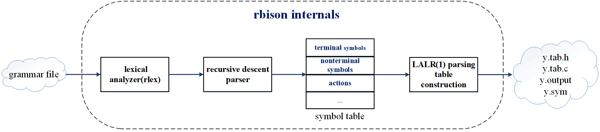

rbison: a clear and simple alternative to GNU rbison
===

`rbison` is a clear and simple alternative to GNU `Bison`. it takes a context-free grammar and generates an LALR(1) parser. with a clean and small codebase, `rbison` is easy to read, understand, and extend - great for learning and exploring how parser work.



Usage
-----------
```
$ cd src && make
$ ./rbison 
rbison 0.02 [gcc 12.2.0] [Jul 22 2025]. (c) 2025, ****. all rights reserved.
usage is: rbison [-options] file

  create an LALR(1) parser from the specification in the
  input file. legal command-line options are:

-a   output actions only (see -p)
-l   suppress #(L)ine directives
-p   output parser only (can be used with -T also)
-s   make (s)ymbol table
-S   make more-complete (S)ymbol table
-t   print all (T)ables (and the parser) to standard output
-T   move large tables from y.tab.c to y.outab.c
-v   print (V)erbose diagnostics (including symbol table)
-V   more verbose than -v. implies -t, & y.output goes to stderr
-w   suppress all warning messages
-W   warnings (as well as errors) generate nonzero exit status
```


Example
-----------
this section shows how to run a calculator built with rbison.

`rbison` uses [rlex](https://github.com/remysys/rlex) to generate the lexer. please install [rlex](https://github.com/remysys/rlex) first:
```
$ git clone https://github.com/remysys/rlex.git
$ cd rlex/src
$ make && make install
```

the `test/` directory contains five examples: `expr_1` to `expr_5`.
each example consists of a `.l` file and a `.y` file:
- the `.l` file defines lexical rules and is processed by `rlex` to generate the lexer.
- the `.y` file defines grammar rules and is compiled by `rbison` to generate the parser.

these examples show how `rbison` and `rlex` work together to build expression calculators with support for basic math, operator precedence, and floating-point numbers.

run `make test` to build five calculator examples in the `test/` directory.
```
$ make test
```
to try out one of the calculator demos:
```
$ ./expr_1
```
then enter an expression like:
```
$ 6 + 6 + 2 * 3
```
the program will evaluate the expression and print the result:
```
$ res = 18
```